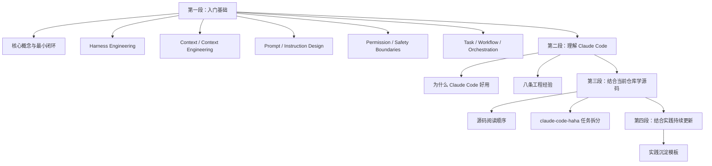
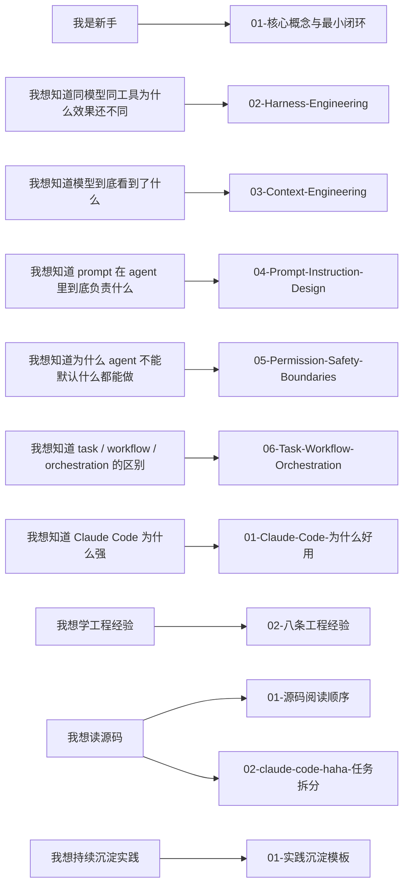

# Claude Code Agent 学习路线图

## 怎么用这份路线图

如果你是新手，不要一上来全读。

先判断你当前最想解决的是哪一类问题，然后进入对应文档。

## 总体学习路径

这套学习内容建议分成 3 段：

### 第一段：入门基础

这一段的目标不是立刻钻源码，而是先把脑子里的概念理顺。

这一段主要回答：

- model / agent / runtime / tool / command 分别是什么
- 这些概念是怎么接成最小 agent 闭环的
- 为什么同模型同工具，agent 结果还是会差很多
- prompt、context、permission、task 到底各自负责什么

### 第二段：理解 Claude Code

这一段主要回答：

- Claude Code 为什么不只是“模型强”
- 它到底解决了哪些普通 agent 没解决好的问题
- 哪些设计是你后面做自己 agent 时可以直接抄走的

### 第三段：结合当前仓库学源码

这一段主要回答：

- 当前仓库应该先看哪几块
- 每一块源码解决什么问题
- 读完之后你应该收获什么

### 第四段：结合实践持续更新

这一段的目标是让这套文档不断长大。

也就是把后面继续遇到的：

- 新问题
- 新误区
- 新理解
- 源码案例
- 自己做 agent 时踩的坑

持续补回仓库。

## 导航

### 我完全是新手，不知道从哪开始

先看：

- [01-核心概念与最小闭环.md](../01-入门基础/01-核心概念与最小闭环.md)

你会先搞清楚：

- model 是什么
- agent 是什么
- runtime 是什么
- tool 是什么
- command 是什么
- 它们是怎么被接成最小闭环的

### 我想知道为什么同模型同工具，agent 效果还是会差很多

看：

- [02-Harness-Engineering.md](../01-入门基础/02-Harness-Engineering.md)

你会搞清楚：

- 什么是 harness engineering
- 它和 prompt engineering 有什么区别
- 为什么 Claude Code 的价值不只是模型强

### 我想知道模型到底是基于什么在做判断

看：

- [03-Context-Engineering.md](../01-入门基础/03-Context-Engineering.md)

你会搞清楚：

- context 不只是聊天记录
- prompt、memory、tool result 和 context 的关系
- 为什么 context engineering 会直接影响 agent 表现

### 我想知道 prompt 在 agent 里到底负责什么

看：

- [04-Prompt-Instruction-Design.md](../01-入门基础/04-Prompt-Instruction-Design.md)

你会搞清楚：

- prompt 和 context 的区别
- prompt 和 harness 的区别
- 为什么 Claude Code 里的 prompt 不是单一文本，而是分层装配出来的

### 我想知道为什么 agent 不能默认什么都能做

看：

- [05-Permission-Safety-Boundaries.md](../01-入门基础/05-Permission-Safety-Boundaries.md)

你会搞清楚：

- 为什么 prompt 里的“不要这样做”不够
- permission 为什么是 runtime 级能力边界
- Claude Code 是怎么同时做模式、规则、角色限制的

### 我想知道 task、workflow、orchestration 到底有什么区别

看：

- [06-Task-Workflow-Orchestration.md](../01-入门基础/06-Task-Workflow-Orchestration.md)

你会搞清楚：

- task 为什么是一等工作对象
- workflow 为什么是推进模板
- orchestration 为什么是在组织复杂任务，而不只是多开几个 agent

### 我想知道 Claude Code 为什么好用

看：

- [01-Claude-Code-为什么好用.md](../02-Claude-Code-理解/01-Claude-Code-为什么好用.md)

你会搞清楚：

- Claude Code 的强不只是模型强
- runtime、permissions、tasks、harness 为什么重要

### 我想直接学习可以抄走的工程经验

看：

- [02-八条工程经验.md](../02-Claude-Code-理解/02-八条工程经验.md)

你会搞清楚：

- 做 agent 时真正值得学的设计原则
- 为什么同模型同工具也会做出差异巨大的 agent

### 我想结合源码来学习

先看：

- [01-源码阅读顺序.md](../03-源码学习/01-源码阅读顺序.md)
- [02-claude-code-haha-任务拆分.md](../03-源码学习/02-claude-code-haha-任务拆分.md)

你会得到：

- 最适合新手的源码阅读顺序
- 每个文件应该重点看什么
- 当前仓库应该拆成哪些学习任务

### 我想把后续学习和实践持续沉淀下来

看：

- [01-实践沉淀模板.md](../04-实践沉淀/01-实践沉淀模板.md)

你会得到：

- 后续怎么记录问题
- 怎么记录新的理解
- 怎么把实践经验补回文档

## 推荐顺序

如果你想系统学，推荐按这个顺序：

1. [01-核心概念与最小闭环.md](../01-入门基础/01-核心概念与最小闭环.md)
2. [02-Harness-Engineering.md](../01-入门基础/02-Harness-Engineering.md)
3. [03-Context-Engineering.md](../01-入门基础/03-Context-Engineering.md)
4. [04-Prompt-Instruction-Design.md](../01-入门基础/04-Prompt-Instruction-Design.md)
5. [05-Permission-Safety-Boundaries.md](../01-入门基础/05-Permission-Safety-Boundaries.md)
6. [06-Task-Workflow-Orchestration.md](../01-入门基础/06-Task-Workflow-Orchestration.md)
7. [01-Claude-Code-为什么好用.md](../02-Claude-Code-理解/01-Claude-Code-为什么好用.md)
8. [02-八条工程经验.md](../02-Claude-Code-理解/02-八条工程经验.md)
9. [01-源码阅读顺序.md](../03-源码学习/01-源码阅读顺序.md)
10. [02-claude-code-haha-任务拆分.md](../03-源码学习/02-claude-code-haha-任务拆分.md)
11. [01-实践沉淀模板.md](../04-实践沉淀/01-实践沉淀模板.md)

## 后面还会继续往下扩的细主题

第一批入门基础现在已经补齐了。

如果后面继续往下补，我会优先补这些更细的基础主题：

- session / state / memory 的进一步拆分
- plan mode 和普通模式的区别
- 多 agent 的结果回流与收敛
