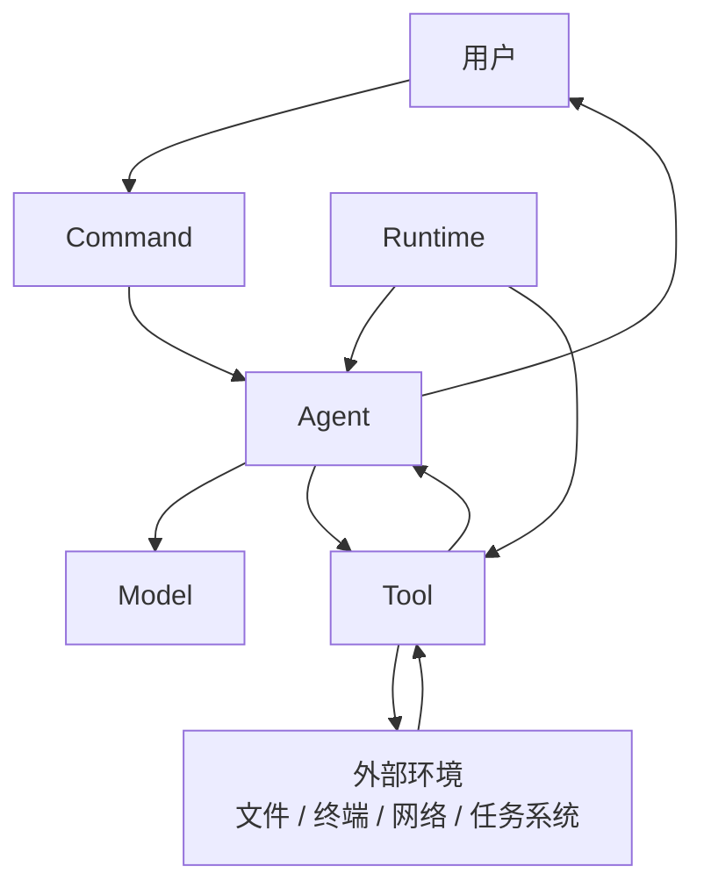
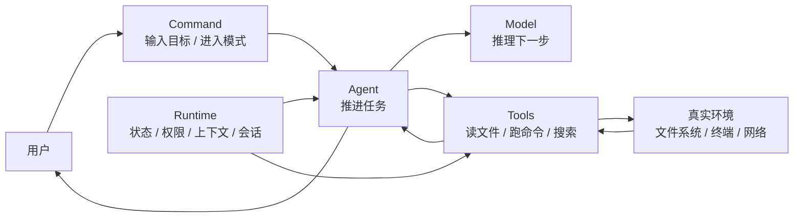

# 核心概念与最小闭环

## 为什么这一章很重要

学 agent 最容易遇到的问题，不是“看不懂代码”，而是：

- 看到了很多词
- 每个词好像都懂一点
- 但放在一起就混了

比如：

- model 和 agent 到底差在哪
- runtime 到底是不是 Node
- tool 和 command 到底是什么关系
- 为什么 Claude Code 不是“模型本身”

如果这些概念在脑子里是乱的，后面无论你看 Claude Code 源码、看别人的 agent 项目，都会越来越乱。

所以这一章的目标不是让你“背术语”，而是先建立一张稳定的概念地图。

## 先看整体关系

这张图先不要急着逐项分析，你先记住两件最重要的事：

1. **Model 负责推理**
2. **Runtime 提供环境和能力，Agent 在中间把推理接到任务推进上**

如果这两件事先记住，后面很多概念都会顺。

## 一句话先抓主干

- model 负责推理
- agent 负责推进任务
- runtime 负责提供运行环境和边界
- tool 负责把意图变成动作
- command 负责给用户一个高层入口

但这一组话只能帮你抓轮廓，真正要理解，还得往下展开。

## 1. Model

### 它到底是什么

Model 就是大模型本身。

在 agent 系统里，它主要负责：

- 理解用户输入
- 理解上下文
- 做推理
- 规划下一步
- 生成输出

如果只看“智能”这一部分，model 就是整个系统里最像大脑的部分。

### 它不负责什么

它不直接：

- 读文件
- 改文件
- 跑终端命令
- 管权限
- 管任务状态

这些都不是 model 单独完成的。

这也是为什么：

- 模型强，不等于产品就一定好用

### 在 Claude Code 里怎么理解

Claude Code 不是 Claude 模型本身。

更准确地说：

- Claude 模型负责“想”
- Claude Code 负责“让这个想法在真实环境里被组织、约束、执行出来”

所以当我们说 Claude Code 很强时，不能只理解成“模型很强”。

### 这里最容易理解错的地方

很多人会下意识把：

- Claude 模型
- Claude Code

当成同一个东西。

更准确的拆法应该是：

- Claude 模型是推理引擎
- Claude Code 是围绕这个推理引擎搭出来的 agent 产品和 runtime

也就是说，模型是 Claude Code 的核心部件之一，但 Claude Code 不等于模型。

### 一个帮助记忆的比喻

你可以先把 model 理解成：

- 人的大脑
- 汽车的发动机

这个比喻的重点不是说“模型等于发动机”，而是帮助你抓住一点：

- 它提供核心能力
- 但它不是整套系统

## 2. Agent

### 它到底是什么

Agent 不是模型本身。

Agent 更像一个“任务执行主体”。
它承接一个目标，然后在多轮里持续推进这个目标。

它做的事情通常包括：

- 调用模型进行推理
- 接收模型推理结果
- 决定系统下一步动作
- 调用工具或继续推进任务
- 持续迭代直到任务完成

### 为什么它不是 model

这里最容易混淆。

很多人会说：

- agent 负责思考

这不够准确。

更准确的说法是：

- model 负责推理
- agent 负责消费推理结果，并把推理接到任务推进上

也就是说，agent 更像：

- 执行逻辑
- 任务推进单元
- 推理和行动之间的桥

### 在 Claude Code 里怎么理解

Claude Code 不是一次性回答用户一句话。

它是：

- 接收目标
- 调模型推理
- 决定要不要读文件、搜代码、跑命令
- 看工具结果
- 再继续推进任务

这里面真正体现出来的，就是 agent 这一层。

### 这里最容易理解错的地方

最常见的误解是：

- agent 会思考

这句话如果只是口语里说说还行，但拿来做学习文档就不够严谨。

更准确的说法应该是：

- model 负责推理
- agent 负责调用推理、接收推理结果，并把它推进成动作和任务流

所以 agent 更像“执行控制层”，不是“大脑”本身。

### 一个更合适的比喻

如果你用汽车类比，我现在认为更准确的是：

- model = 发动机
- agent = 变速箱 / 传动系统 / 执行控制层

为什么这样更合适：

- 发动机有动力，不代表车已经前进
- 还需要一层把动力真正接到轮子上

这就像：

- model 有推理能力
- 还需要 agent 把推理结果接到任务推进里

## 3. Runtime

### 它到底是什么

Runtime 是承载 agent 运行的底座。

它不是单个函数，也不是一条 prompt，而是一整套运行层。

通常会负责：

- 提供工具
- 管理状态
- 管理上下文
- 控制权限
- 管理任务
- 管理输入输出
- 和文件系统、终端、网络等环境交互

### 为什么它很重要

如果没有 runtime，模型就只是模型。

就算它“知道”应该读文件、跑命令、改代码，也没有办法真正完成这些动作。

所以 runtime 的作用是：

- 让 agent 可以活在真实环境里

### 在 Claude Code 里怎么理解

Claude Code 最值得学的地方之一，就是它不是只套了一层 prompt。

它把这些都做进去了：

- command 系统
- tool 系统
- permission system
- task 机制
- coordinator
- terminal UI

这些合在一起，才更像 Claude Code 的 runtime。

### 最容易混淆的两个点

#### Runtime 不是操作系统

macOS / Linux / Windows 是宿主环境。
Claude Code runtime 是运行在宿主环境之上的 agent 系统层。

#### Runtime 不是 Node

Node 是 JavaScript runtime。
Claude Code runtime 是建立在 Node 之上的 agent 运行系统。

### 为什么这块总是容易混

因为 `runtime` 这个词在不同语境里本来就会重复出现。

比如：

- 操作系统也可以被理解成某种运行环境
- Node 也是 runtime
- JVM 也是 runtime
- Claude Code 这种 agent 系统也可以被叫 runtime

真正要区分的不是“它是不是 runtime”，而是：

- 它是哪个层级的 runtime
- 它在为谁提供运行能力

放到这里，Claude Code runtime 指的是“agent 这一层的运行系统”，不是宿主操作系统，也不是 JavaScript 解释器本身。

### 一个帮助记忆的比喻

你可以先把 runtime 理解成：

- 整辆车的控制系统
- 一个给 agent 用的小型操作系统

这个比喻的重点是：

- 它不是单个零件
- 它是让整套系统可以协调运转起来的底层结构

## 4. Tool

### 它到底是什么

Tool 是 runtime 暴露给 agent 的动作接口。

比如：

- 读文件
- 改文件
- 跑命令
- 搜内容
- 调外部资源

### 为什么 tool 是核心，而不是附属品

很多人一开始会觉得 tool 只是“加一点功能”。

其实不对。

对 agent 来说，tool 决定了它到底能不能接触外部世界。

没有 tool，模型只能：

- 理解文字
- 生成文字

有了 tool，agent 才能真正：

- 看文件
- 改代码
- 跑命令
- 操作环境

这也是为什么常说：

- prompt 决定怎么想
- tool 决定能做什么

### 在 Claude Code 里怎么理解

Claude Code 不只是聊天工具，就是因为它背后有一整套工具系统。

模型不是空想，而是真的可以在边界内调用动作能力。

### 这里最容易理解错的地方

很多人最开始会把 tool 理解成：

- 附加功能
- 可有可无的小插件

但在 agent 里，tool 不是外挂，而是能力边界本身。

没有 tool，模型再聪明，也只能停留在“会生成文字”这一层。

### 一个帮助记忆的比喻

tool 可以先理解成：

- 扳手、螺丝刀、终端
- 方向盘、油门、刹车

重点在于：

- tool 不是目标
- tool 是把目标变成动作的手段

## 5. Command

### 它到底是什么

Command 是面向用户的高层入口。

例如：

- `/review`
- `/config`
- `/memory`

它的作用不是给模型做底层动作接口，而是让用户能明确进入某种任务或产品功能。

### 为什么 command 和 tool 不能混成一层

这点非常关键。

更清楚的分工是：

- command 面向用户
- tool 面向模型

如果这两层混在一起，会带来很多混乱：

- 用户入口不清晰
- 模型容易乱用高层能力
- 产品层和执行层会缠在一起

### 在 Claude Code 里怎么理解

Claude Code 是产品，不只是底层 runtime。

所以它既要有：

- command 系统，服务用户交互

也要有：

- tool 系统，服务模型执行

### 这里最容易理解错的地方

最容易混淆的是：

- command 和 tool 差不多

其实不是。

更准确的分层是：

- command 是用户入口
- tool 是模型动作接口

一个是产品交互层，一个是执行能力层。

### 一个帮助记忆的比喻

command 可以先理解成：

- 点菜单
- 软件里的功能入口

重点在于：

- 用户不是直接操作所有底层能力
- 用户先通过高层入口表达目标

## 6. 最小闭环：Agent Loop

前面这 5 个概念更像是在回答：

- 系统里有哪些关键角色
- 每个角色分别负责什么

但如果只停在这里，你还是会差最后一步：

- 这些角色到底是怎么连起来运转的

这就是为什么 `Agent Loop` 应该收进这一章，而不是单独漂在外面。

因为它不是另一个平行主题，而是前面这些概念在运行时的最小组合方式。

### 最小闭环长什么样

最简形式通常就是：

1. 用户给目标
2. 模型推理
3. agent 选择动作
4. runtime 执行动作或工具
5. 结果回流给模型
6. 循环直到任务完成

### 每一步到底在干什么

#### 1. 用户给目标

用户通常不会给完整步骤，而是给一个目标，比如：

- 帮我分析这个仓库
- 帮我修这个 bug
- 帮我 review 代码

#### 2. 模型推理

模型会判断：

- 这是个什么任务
- 还缺什么信息
- 下一步应该读文件、搜代码、跑命令，还是先提问

#### 3. agent 选择动作

agent 接住模型的推理结果，把它接到执行逻辑上。

也就是说，这一层会把：

- “我想读文件”
- “我想调用搜索”
- “我想请求确认”

变成系统下一步真正要做的事。

#### 4. runtime 执行动作或工具

runtime 负责：

- 检查工具是否可用
- 检查权限是否允许
- 真正执行动作
- 收集结果

#### 5. 结果回流给模型

工具执行后的结果，比如：

- 文件内容
- 命令输出
- 搜索结果
- 错误信息

会再被送回模型，成为下一轮推理输入。

#### 6. 循环直到结束

如果任务还没完成，就继续下一轮：

- 再推理
- 再选动作
- 再执行

直到满足停止条件。

### 这里最容易理解错的地方

最常见的误解是：

- agent 就是“会回答很多轮”

这还不够准确。

真正重要的不是轮数多，而是：

- 系统会根据动作结果和环境反馈，持续修正下一步行为

这才是 loop 的核心。

### 在 Claude Code 里为什么这一段很重要

因为 Claude Code 本质上就是一个成熟的 tool-using agent 系统。

你学懂这个最小闭环，后面再看：

- tools
- permissions
- tasks
- coordinator
- harness

就会顺很多。

## 7. 在当前 claude-code-haha 里，Claude Code 大概是怎么做的

如果先不看具体文件，我建议你先抓 Claude Code 在“核心概念与最小闭环”这件事上的 4 个实现思路。

### 先看 Claude Code 最小闭环图

这张图你可以先只抓两件事：

- 上面这条线是在跑 `用户 -> 推理 -> 动作 -> 反馈`
- `Runtime` 像一层底座，在旁边持续给 `Agent` 和 `Tools` 提供环境、边界和状态

### 思路 1：把“用户入口”和“模型动作”分层

Claude Code 没有把所有东西都做成一种接口。

它明显分了两层：

- command 层，给用户使用
- tool 层，给模型调用

这样做的好处是：

- 用户知道自己在触发什么功能
- 模型只拿到底层动作能力
- 产品交互层和执行层不会缠在一起

### 思路 2：把“模型推理”和“系统运行”分层

Claude Code 不是把模型直接扔到终端里裸奔。

它会把：

- model
- runtime
- tools
- permissions
- state

这些东西明确放在不同层里。

这样模型负责“想”，系统负责“让它能在边界内干活”。

### 思路 3：把 agent 看成一个持续推进任务的闭环

Claude Code 的核心显然不是“一问一答”。

它的真实运行方式更像：

- 接收目标
- 调模型推理
- 调工具
- 收结果
- 再推进下一轮

也就是说，它从一开始就是按 loop 来组织，而不是按一次性回答来组织。

### 思路 4：把闭环做成产品，而不只是 demo

Claude Code 不是一个实验脚本，而是把这条闭环真正做成了产品化系统。

所以它会同时考虑：

- CLI / REPL 入口
- command 体系
- tool 池
- 权限模式
- 多 agent / task
- 会话和状态

这也是为什么你学这章时，不应该只背定义，而要看到它们在系统里是怎么真正站住位置的。

## 8. 在当前 claude-code-haha 源码里怎么对应

这一章不需要一上来啃很多文件，但我建议你先抓住 5 个总入口。

### 1. `src/main.tsx`

这是总装配入口之一。

从这里你能看到：

- CLI 参数最后怎么汇进主流程
- 会话怎么初始化
- commands / context / permissions / model 等东西怎么被装起来

它适合帮助你建立：

- “这不是一个单文件脚本，而是一个完整 runtime”

### 2. `src/entrypoints/cli.tsx`

这个文件更像启动路由层。

它会先处理一些 fast path，再决定是否进入完整主流程。

它适合帮助你理解：

- Claude Code 的入口不是单一聊天入口
- 它本质上是一个多模式 CLI runtime

### 3. `src/tools.ts`

这里非常适合拿来理解：

- tool pool 是怎么组出来的
- 不同权限上下文下，tool 为什么会不同
- agent 能力边界为什么本质上来自 tool

它对应的是你这一章里的：

- tool
- runtime
- 闭环里的动作层

### 4. `src/commands.ts`

这里适合帮助你理解：

- 为什么 command 和 tool 不是一回事
- 用户入口层是怎么组织出来的
- slash command 为什么属于产品交互层

它对应的是你这一章里的：

- command
- 用户入口

### 5. `src/context.ts`

这个文件适合帮助你理解：

- runtime 不只是管工具
- 它还会准备系统上下文和用户上下文

它对应的是：

- runtime
- context
- 闭环里的输入准备层

### 你现在读源码时可以带着这 4 个问题去看

1. 这段代码是在定义角色，还是在连接角色？
2. 它属于用户入口层，还是模型动作层？
3. 它是在让系统“能做更多”，还是让系统“更可控”？
4. 它在最小闭环的哪一步发挥作用？

## 9. 最后把这些概念重新串起来

如果你现在再看这些概念，我建议这样记：

- model 提供推理能力
- agent 把推理结果接成任务推进
- runtime 提供环境、状态、权限和机制
- tool 提供动作接口
- command 提供用户入口
- agent loop 把这些角色真正接成一个会运转的系统

## 汽车类比版总图

- model = 发动机
- agent = 变速箱 / 传动系统 / 执行控制层
- runtime = 整车控制系统
- tool = 方向盘 / 油门 / 刹车 / 工具箱
- command = 用户输入“我要去哪”
- agent loop = 车辆持续感知路况并不断修正行驶动作的闭环

这个类比不是为了精确替代定义，而是为了帮你先抓住结构关系。

如果你要更严谨一点地理解它，可以这样看：

- 发动机提供动力，对应 model 提供推理能力
- 变速箱把动力真正传出去，对应 agent 把推理接到任务推进
- 整车控制系统保证整辆车能稳定运转，对应 runtime 提供环境、边界和机制
- 方向盘、油门、刹车这些控制件，对应 tool 这类动作接口
- 用户告诉车“我要去哪”，对应 command 这种高层入口

## 这一章最重要的收获

如果你只带走一句话，我希望是这句：

**model 提供推理能力，agent 把推理接到任务推进，runtime 提供环境和边界，tool 提供动作接口，command 提供用户入口，而 agent loop 把这些角色真正接成一个会运转的系统。**
