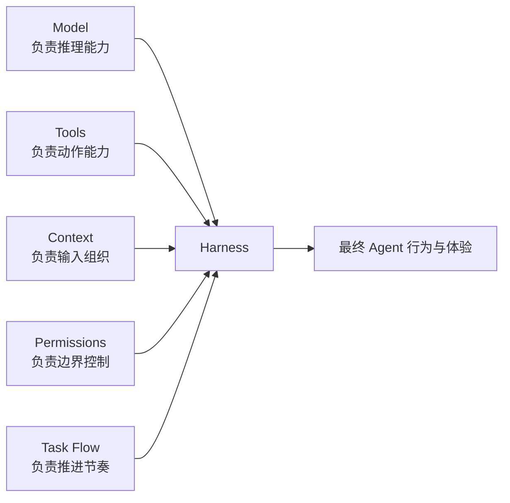
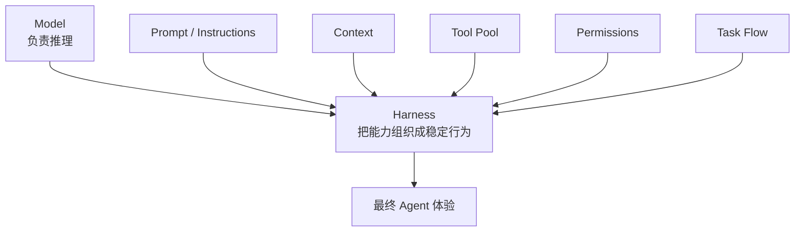

# Harness Engineering

## 为什么这一章应该放在前面

因为学到这里，我们已经不只是想分清几个概念了，而是要开始回答一个更关键的问题：

**为什么同样的模型、同样的工具，不同 agent 的效果还是会差很多？**

这个问题如果不先搞清楚，后面去看 Claude Code 源码时，很容易只看到：

- 它有很多文件
- 它有很多工具
- 它有很多功能

但看不出真正值得学的地方。

所以在进入源码学习之前，先理解 harness engineering，会更容易抓住重点。

## 一句话理解

Harness engineering 就是：

**把模型、工具、上下文、权限、任务流和输出方式组织成一个稳定 agent 闭环的工程。**

## 先看关系图

这张图想表达的是：

- 最终体验不是模型单独决定的
- harness 是把这些能力组织成“可用 agent”的关键一层

## 如果只看模型，会漏掉什么

很多人一开始学 agent 时，只会先关注：

- 模型强不强
- prompt 写得好不好
- tool 多不多

但这还不够。

因为即使：

- 模型一样
- 工具一样

最后结果仍然可能差很多。

中间的差异，通常来自这些问题：

- 工具描述怎么写
- 什么时候调用工具
- 调完工具结果怎么回流
- 上下文怎么组织
- 权限怎么限制
- 什么时候停止
- 什么时候问用户确认
- 出错以后怎么恢复

这些事情，很多都属于 harness engineering。

## 一个帮助理解的比喻

如果：

- model = 发动机
- agent = 变速箱 / 传动系统 / 执行控制层
- runtime = 整车控制系统

那么 harness 更像：

- 换挡逻辑
- 制动逻辑
- 仪表反馈
- 自动驾驶规则
- 整套驾驶控制策略

这个比喻想说明的是：

- 不是有发动机就等于车一定好开
- 也不是有工具就等于 agent 一定好用
- 真正的差异，常常来自整套系统怎么被组织起来

## Harness 和 Prompt Engineering 的区别

### Prompt Engineering 更关注

- 怎么写 system prompt
- 怎么写 instruction
- 怎么让模型说得更符合预期

### Harness Engineering 更关注

- 整个 agent loop 怎么设计
- tools 怎么接入
- 权限怎么限制
- 上下文怎么组织
- 出错怎么恢复
- stop condition 怎么定义
- 多 agent 怎么协调

一句话说：

- prompt engineering 更像“教模型怎么说”
- harness engineering 更像“设计整个 agent 怎么工作”

## 为什么 Claude Code 特别适合学这一章

因为 Claude Code 值得学的地方，不只是“它用了 Claude 模型”，而是它把这些东西做成了系统：

- command 和 tool 分层
- runtime 组织方式
- permission system
- task flow
- multi-agent 限制
- terminal interaction
- source-based modular structure

所以它非常适合用来学习：

- 一个成熟 agent 产品到底是怎么被工程化出来的

## 7. 在当前 claude-code-haha 里，Claude Code 大概是怎么做的

如果先不盯着具体文件，我建议你先抓 Claude Code 在 harness 这件事上的 4 个实现思路。

### 先看 Harness 分层图

这张图最值得记住的是：

- `Harness` 不是一个单独零件
- 它更像一个组织层，把 `prompt / context / tools / permissions / task flow` 一起接到最终体验上

### 思路 1：先定义能力池，再按权限和模式裁剪

Claude Code 不是先让模型自由发挥，再临时拦截。

它更像是：

- 先准备基础工具池
- 再按 permission context 过滤
- 再按 agent 类型、模式、角色进一步裁剪

这说明它的 harness 思路不是“先放开再补洞”，而是“先分层再放权”。

### 思路 2：prompt、context、tools 不是分开玩的

Claude Code 明显不是只在做 tool calling。

它会同时组织：

- system prompt
- user/system context
- tool pool
- permission checks

也就是说，最终行为不是某一层单独决定，而是这些层一起工作。

### 思路 3：权限和约束被当成一等公民

Claude Code 很值得学的一点是：

- 它不只是在加功能
- 它也在系统性地加边界

比如：

- 哪些工具 async agent 能用
- 哪些工具 subagent 不能用
- 哪些模式只允许特定工具

这就是典型的 harness engineering，而不是简单功能堆叠。

### 思路 4：让行为差异来自系统设计，而不只来自模型差异

Claude Code 的价值之一就在于：

- 它通过系统层设计，把同一个模型塑造成更稳定、更可控的 agent

这也是为什么我们学 harness 时，重点不是“某句 prompt 怎么写”，而是：

- 整套系统如何塑造最终行为

## 8. 在当前 claude-code-haha 源码里怎么对应

如果你想把 harness 这件事落回代码，我建议先看 4 个点。

### 1. `src/tools.ts`

这个文件能帮你看到：

- 工具池是怎么定义的
- deny rules 怎么影响工具可见性
- `assembleToolPool(...)` 这种函数怎么把 built-in tools 和 MCP tools 组起来

这能帮助你理解：

- harness 里“能力组织”这一层

### 2. `src/constants/tools.ts`

这个文件特别重要，因为它直接把很多“角色差异”写成了显式集合。

比如：

- `ALL_AGENT_DISALLOWED_TOOLS`
- `ASYNC_AGENT_ALLOWED_TOOLS`
- `COORDINATOR_MODE_ALLOWED_TOOLS`

它很适合帮助你理解：

- 为什么多 agent 不是简单复制主线程能力
- 为什么 harness 设计里，限制和过滤跟能力同样重要

### 3. `src/utils/systemPrompt.ts`

这个文件能看到 Claude Code 的 system prompt 不是固定文本，而是分层装配。

这对应 harness 里的：

- 行为规则组织
- 模式差异
- agent prompt / custom prompt / append prompt 的优先级

它很适合帮助你理解：

- harness 不只是工具和权限，也包括行为规则装配

### 4. `src/QueryEngine.ts`

这个文件能看到 query 真正跑起来前，系统怎么把：

- prompt
- context
- permissions
- canUseTool

这些东西接到同一个执行闭环里。

这很关键，因为它会让你看到：

- harness 不是散落在各处的小技巧
- 它是在 query 主循环里真正落地的

### 你现在读源码时可以带着这 4 个问题去看

1. 这段代码是在组织能力，还是在组织约束？
2. 它影响的是模型能做什么，还是该怎么做？
3. 它是在塑造单轮行为，还是在塑造整条执行闭环？
4. 如果删掉这一层，最终用户体验会变差在哪里？

## 9. 对后面读源码最有帮助的 4 个抓手

后面读源码时，你可以反复问自己这 4 个问题：

### 1. 这段代码在 agent 闭环里解决了什么问题

不是只问“这段代码做了什么”，而是问：

- 它在整个系统里补的是哪一层

### 2. 它是在塑造什么行为

例如：

- 让模型更保守
- 让工具调用更清晰
- 让任务推进更稳定

### 3. 它是在增加能力，还是在增加约束

成熟 agent 系统不只是加功能，也会不断加边界。

### 4. 它为什么会影响最终体验

因为很多产品差异并不来自模型，而来自：

- harness 怎么组织能力
- runtime 怎么限制行为

## 这一章最重要的收获

如果你只带走一句话，我希望是这句：

**Claude Code 的价值，不只是模型强，而是 Anthropic 把这套 agent 系统的 harness 做得比较成熟。**
