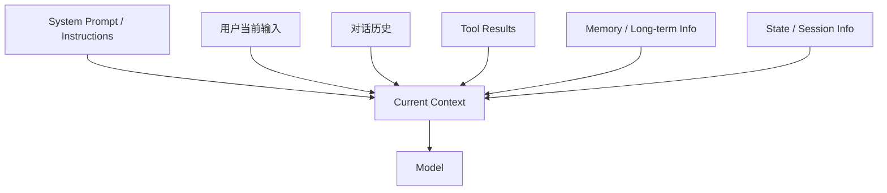
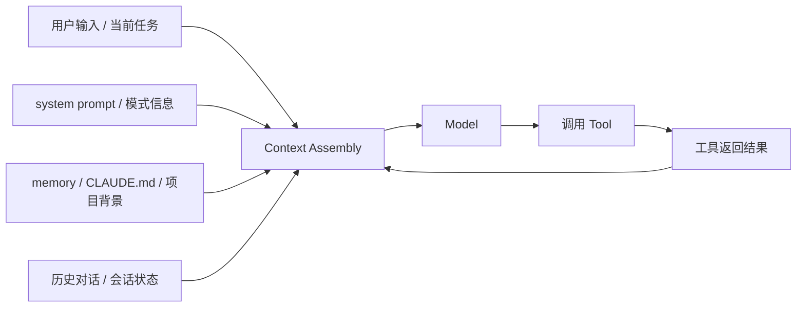

# Context / Context Engineering

## 为什么这一章很重要

很多人学 agent 时，一开始只会盯着两个东西：

- 模型强不强
- prompt 写得好不好

但真正做起来以后，很快就会发现另一件同样关键的事：

**模型这一轮到底看到了什么。**

这就是 `context`。

很多时候，agent 做得差，不一定是模型不行，而是：

- 该给的信息没给
- 给了太多无关信息
- 信息顺序不对
- 新信息没有及时回流
- 长期信息和当前信息混在一起

所以这一章要解决的不是一个小术语，而是一个非常核心的问题：

**模型到底是基于什么在做判断。**

## 一句话先抓住

- `context` 是模型当前这轮能看到的全部相关信息
- `context engineering` 是你如何把这些信息组织给模型看

## 先看关系图

这张图最重要的是一句话：

**模型不是基于“系统里有什么”来判断，而是基于“当前 context 里有什么”来判断。**

## Claude Code 里这件事大概怎么流动

这张图的作用不是替代源码，而是先帮你看到主干：

- 上下文不是一次性固定好
- 而是会随着工具执行不断扩展
- Claude Code 要做的，是持续控制这条闭环不要失控

## 1. Context 到底是什么

在 agent 系统里，context 不是单指“前面聊过的话”。

更准确地说，它是模型当前这一轮推理时真正看到的输入视野。

可能包括：

- 当前用户问题
- system prompt
- 对话历史
- 文件内容
- 工具返回结果
- 当前任务状态
- 权限信息
- 环境信息

所以你可以先把 context 理解成：

- 模型当前桌面上摊开的资料

资料没摊出来，哪怕系统里“其实有”，模型也等于没看到。

## 2. Context 和 Prompt 是什么关系

这两个词最容易混。

### Prompt 更像什么

Prompt 更像规则和要求。

比如：

- 你是一个代码 agent
- 优先读代码再回答
- 不要做危险操作
- 用中文输出

它在告诉模型：

- 你该怎么做事

### Context 更像什么

Context 是这一轮真正喂给模型看的所有信息。

所以更准确的关系是：

- prompt 是 context 的一部分
- 但 context 不只包含 prompt

## 3. Context 和 Memory 是什么关系

Memory 也很容易和 context 混。

更好理解的方式是：

- context = 当前桌面
- memory = 抽屉里存着的资料

Memory 指的是可以跨轮次、跨任务保存下来的信息，比如：

- 用户长期偏好
- 某个项目的稳定背景
- 之前任务得出的结论

但 memory 不会自动等于当前 context。

系统通常需要决定：

- 什么时候把 memory 取出来
- 取哪部分
- 以什么形式放进当前 context

所以：

- memory 是可回收的信息仓库
- context 是当前真正参与判断的信息视野

## 4. Tool Result 为什么也属于 Context

Agent 一旦开始调用工具，就会不断产生新信息。

比如：

- 读文件得到源码
- 执行命令得到终端输出
- 搜索得到匹配结果

这些东西在刚开始并不在 context 里。

是工具执行后，它们才被带回模型面前，进入下一轮 context。

所以 tool result 本质上是：

- 运行过程中新增的动态上下文

这也是 agent 和普通问答系统一个很大的差异。

普通问答更多是静态输入。  
agent 是动态扩展 context。

## 5. 什么是 Context Engineering

如果说 context 是“模型看到什么”，那 context engineering 就是：

**你如何决定让模型看到什么，以及怎么组织这些信息。**

它通常会涉及这些问题：

- 先给哪些信息，后给哪些信息
- 哪些信息必须完整保留
- 哪些信息可以压缩
- 工具结果要不要全量回流
- 历史对话保留多少
- memory 在什么时机注入
- 当前任务状态如何表达

所以 context engineering 的核心不是“多塞信息”，而是：

**给模型刚刚好的信息视野。**

## 6. 为什么这件事会直接影响 agent 效果

同一个模型、同一套工具，不同 agent 的结果可能差很多。

其中一个很核心的差异来源就是：

- 上下文组织方式不同

比如常见差异有：

- A agent 会先把目标、代码片段、工具结果整理后再推理
- B agent 会把原始信息一股脑塞进去

又比如：

- A agent 会把旧信息压缩，只保留关键结论
- B agent 会让历史噪音不断累积

最终结果就会明显不同。

所以很多时候：

- 不是模型不够强
- 而是 context 没组织好

## 7. 在 Claude Code 里为什么必须学这个

Claude Code 不是单轮聊天工具，而是一个持续调用工具、不断回流结果的 agent 系统。

这就意味着它一定高度依赖：

- 当前上下文怎么组织
- 工具结果怎么回流
- 会话状态怎么保留
- 长期信息怎么注入

所以你后面读源码时，看到这些模块都要带着 context 视角去看：

- conversation / history
- tool outputs
- memory
- state / session
- prompt assembly

很多表面上分散的代码，其实都在服务同一件事：

- 让模型在每一轮看到合适的信息

## 8. 在当前 claude-code-haha 里，Claude Code 大概是怎么做的

如果先不盯着具体文件，我建议你先抓 Claude Code 在这件事上的 3 个实现思路：

### 思路 1：先把上下文拆层，而不是混成一坨

Claude Code 不是把所有信息都塞进一个大字符串里。

它至少会把上下文拆成几类：

- system 级信息
- user 级信息
- memory / `CLAUDE.md` 相关信息
- 工具回流结果
- 会话 / 状态相关信息

这样做的好处是：

- 更容易控制哪些信息该进、哪些不该进
- 更容易做缓存和预取
- 更容易后续做压缩和分析

### 思路 2：把 context 当成运行时资源来管理

Claude Code 不只是“有上下文”，而是把它当成一个会膨胀、会变脏、会影响成本和性能的运行时资源。

所以它会关心：

- 首轮要不要预取
- 当前上下文是否快满了
- 哪些 tool result 太大
- memory 文件是不是占太多 token
- 什么时候该 compact

这说明它对 context 的态度不是“静态背景板”，而是“持续管理的系统资源”。

### 思路 3：让上下文既服务效果，也服务速度

很多人一说 context，就只想到“给模型更多资料”。

Claude Code 更像是在平衡两件事：

- 让模型尽量知道该知道的东西
- 又不要让准备上下文的成本把交互速度拖垮

所以你会看到它一边准备上下文，一边也在做：

- 并行预取
- suggestions
- compact
- token 相关控制

这很值得学，因为它说明优秀 agent 不是只追求“知道更多”，而是追求“知道得刚刚好”。

## 9. 你在源码里先看哪几个点

如果你想把这一章和当前仓库连起来，建议先看这几个文件：

- [context.ts](../../src/context.ts)
  这里是上下文相关逻辑的一个核心入口
- [main.tsx](../../src/main.tsx)
  能看到上下文、命令、agent、系统信息是如何在启动阶段并行准备的
- [contextSuggestions.ts](../../src/utils/contextSuggestions.ts)
  能看到 Claude Code 不只是“有 context”，还在主动给出上下文建议

阅读时建议带着这几个问题：

- 它把哪些信息当成 context
- 它是一次性准备，还是分阶段准备
- 工具结果是怎么回流的
- 它有没有把 context 当资源来管理

## 10. 这一章最值得记住的结论

你可以先记住这 4 句话：

- context 决定模型当前看到了什么
- memory 不等于当前 context
- tool result 会持续扩展 context
- context engineering 不是堆信息，而是组织信息

## 11. 一个帮助记忆的比喻

你可以把它记成：

- model = 大脑
- context = 当前摊在桌上的资料
- memory = 抽屉里存着的资料

大脑不是基于“家里有多少资料”做判断，  
而是基于“桌上现在摆了什么资料”做判断。

这就是 context 为什么关键。
