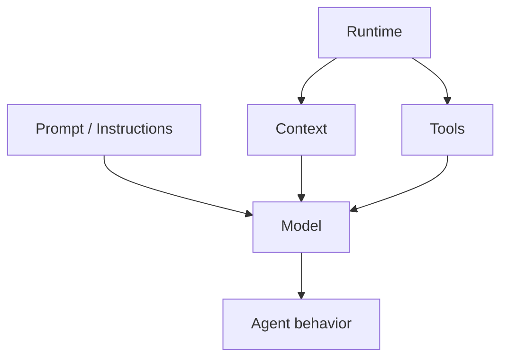
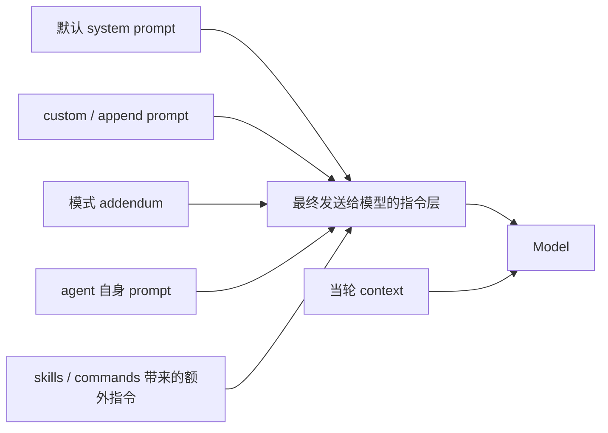

# Prompt / Instruction Design

## 为什么这一章很重要

很多人学 agent 时，最先接触到的词往往就是 prompt。

这没有问题，但也最容易带来两个误区：

- 误以为 agent 主要就是“写 prompt”
- 误以为 prompt 就等于 system prompt 那一段文字

这两个理解都太窄了。

在真正的 agent 系统里，prompt 当然很重要，但它更像：

- 行为规则
- 工作说明书
- 优先级声明
- 约束与风格要求

它不是整个 agent，但它会深刻影响：

- 模型怎么理解自己的角色
- 工具怎么被描述
- 风险怎么被提醒
- 输出风格怎么被统一

所以这一章要解决的是：

**prompt 在 agent 里到底负责什么，以及它和 runtime、context、tool、harness 分别是什么关系。**

## 一句话先抓住

- `prompt` 负责告诉模型“该怎么做事”
- `instruction design` 负责把这些要求组织成稳定、可执行、可维护的提示结构

## 先看关系图

这张图想表达的是：

- prompt 会影响模型行为
- 但模型行为不是只由 prompt 决定
- runtime、tools、context 也在共同塑造最终 agent

## Claude Code 里 prompt 是怎么被装起来的

这张图最重要的是一句话：

**Claude Code 里的 prompt 不是一段写死的总提示词，而是一层层装配出来的。**

## 1. Prompt 到底是什么

Prompt 可以理解成系统给模型的行为说明。

它通常会包含：

- 你是谁
- 你要完成什么类型的任务
- 你该遵守哪些规则
- 你该如何表达结果
- 你有哪些边界和禁区

在 agent 里，prompt 不只是“开场白”，而是工作方式声明。

比如：

- 优先读代码再回答
- 不要猜测未验证的信息
- 遇到高风险动作先确认
- 回答要简洁、结构清晰

这些都属于 prompt 的作用范围。

## 2. Prompt 和 Context 有什么区别

这两个词很容易混。

更清楚的拆法是：

- prompt 更像规则
- context 更像资料

也就是说：

- prompt 告诉模型应该怎么做
- context 告诉模型当前有什么信息可用

所以 prompt 是模型工作方式的一部分，  
而 context 是模型工作材料的一部分。

你可以记成：

- prompt = 工作要求
- context = 当前桌面资料

## 3. Prompt 和 Harness 有什么区别

这也是一个很关键的区别。

### Prompt 更关注

- 模型该遵守什么规则
- 模型该如何思考和表达

### Harness 更关注

- 整个 agent loop 怎么跑
- tool 怎么接
- 权限怎么控
- 上下文怎么回流
- 失败怎么恢复

所以：

- prompt 更像“对模型说的话”
- harness 更像“把模型放进系统里工作的工程方式”

这也是为什么不能把 Claude Code 的优秀只归功于模型和 prompt。

## 4. 什么是 Instruction Design

Instruction design 可以理解成：

**你如何把一堆行为要求写成一套稳定、清楚、可复用的提示结构。**

它比单纯“写一段 prompt”更强调结构化。

通常会涉及：

- 哪些规则必须放前面
- 哪些规则应该单独成段
- 哪些要求属于角色定义
- 哪些要求属于安全边界
- 哪些要求属于输出风格
- 哪些要求应该由 prompt 承担，哪些不该靠 prompt 承担

所以 instruction design 的核心不是“写得玄”，而是：

- 写得清楚
- 写得稳定
- 写得不容易互相打架

## 5. 为什么 prompt 很重要，但不能被神化

很多初学者容易在两个极端之间摇摆：

### 极端 1：prompt 万能论

认为只要 prompt 写得够好，agent 就会变强。

### 极端 2：prompt 无所谓论

认为 runtime 和 tools 才重要，prompt 无足轻重。

这两个都不对。

更合理的理解是：

- prompt 很重要
- 但 prompt 只负责系统的一部分

prompt 可以塑造：

- 角色
- 风格
- 优先级
- 安全提醒

但它不能单独替代：

- tool design
- context engineering
- permission system
- task orchestration

所以你可以先记住：

**prompt 决定模型更像什么样的执行者，但不决定整个执行系统本身。**

## 6. 在 Claude Code 里为什么要学这一章

Claude Code 很适合拿来学 prompt / instruction design，因为它不是“只有一段总 prompt”。

你会看到它有明显的分层：

- 默认 system prompt
- 自定义 system prompt
- append system prompt
- agent 自己的 system prompt
- 某些模式下的额外 addendum
- skills / commands 触发的 prompt 扩展

这说明在 Claude Code 里，prompt 不是一个静态文本块，而是一个会被组合、替换、追加的结构。

这非常值得学。

## 7. 在当前 claude-code-haha 里，Claude Code 大概是怎么做的

如果先不盯着具体文件，我建议你先抓 Claude Code 在 prompt 这件事上的 4 个实现思路：

### 思路 1：prompt 不是单一来源，而是分层装配

Claude Code 不是只有一段固定 system prompt。

它会根据当前模式和角色，组合不同来源：

- 默认 prompt
- agent prompt
- custom prompt
- append prompt
- 某些模式下的 addendum

这意味着它把 prompt 当成“可装配结构”，不是“固定文本”。

### 思路 2：不同角色和模式，会改 prompt 的优先级

Claude Code 明显不是所有场景都用同一套 prompt。

比如：

- 主线程 agent
- coordinator 模式
- custom agent
- skills 触发的额外 prompt

它们的差异不只是功能不同，而是连“系统该如何描述自己”都会变化。

### 思路 3：prompt 和 context 是并行准备、最后汇合

Claude Code 的思路不是“先写一段 prompt，剩下再说”。

它更像是：

- 一边准备 prompt
- 一边准备 context
- 最后在 query 前汇合成这轮请求

这很值得学，因为它说明 prompt 在工程里不是孤立工作的。

### 思路 4：skills / commands 也可能通过 prompt 扩展行为

Claude Code 里的很多技能，不是直接执行逻辑，而是生成额外 prompt 内容。

这说明它把 prompt 也当成一种扩展机制。

所以读源码时，你不能只在“prompt 文件”里找 prompt，还要看：

- skills
- commands
- agent definitions

## 8. 你在源码里先看哪几个点

如果你想把这一章和当前仓库连起来，建议先看这几个文件：

- [systemPrompt.ts](../../src/utils/systemPrompt.ts)
  这里最适合理解 Claude Code 是怎么组织 system prompt 的
- [QueryEngine.ts](../../src/QueryEngine.ts)
  这里更适合理解 prompt 和 context 最终是怎么汇到一次 query 里的
- [REPL.tsx](../../src/screens/REPL.tsx)
  这里能帮助你理解交互层是怎么把 prompt 相关输入接进主流程的
- [loadSkillsDir.ts](../../src/skills/loadSkillsDir.ts)
  这里能帮你理解 skills 为什么也会影响最终 prompt

阅读时建议带着这几个问题：

- 它有哪些 prompt 来源
- 是谁在拼接这些 prompt
- 哪些 prompt 会随着模式变化
- skills / commands 是不是也会改变指令层

## 9. 这一章最值得记住的结论

你可以先记住这 4 句话：

- prompt 负责行为规则，不负责全部执行系统
- prompt 和 context 不是一回事
- Claude Code 的 prompt 是分层装配的
- instruction design 关注的是稳定、清楚、可维护

## 10. 一个帮助记忆的比喻

你可以把它记成：

- model = 发动机
- prompt = 驾驶规则和导航要求
- context = 当前路况和仪表盘信息
- harness = 整车控制逻辑

发动机很重要，  
但“往哪开、按什么规则开、现在路况怎样、车怎么接入实际控制”不是一回事。
