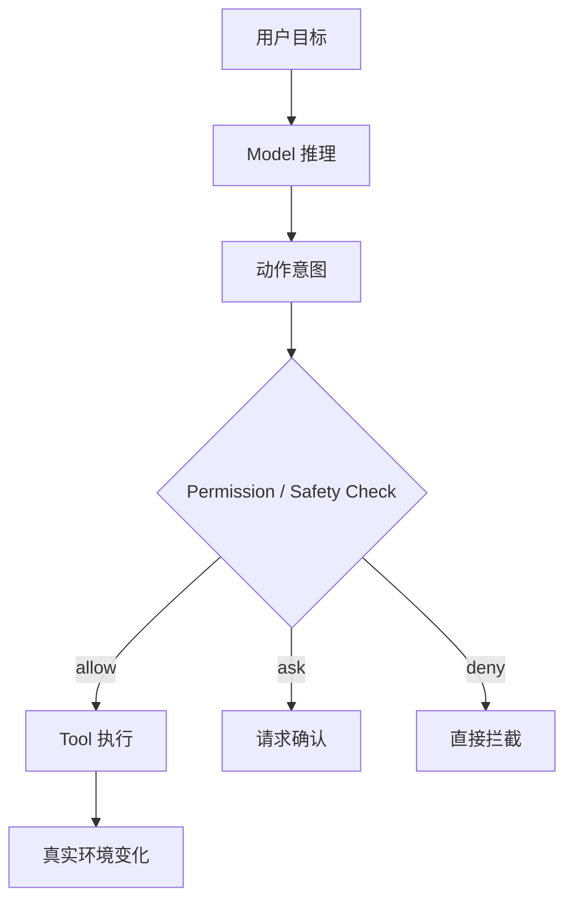
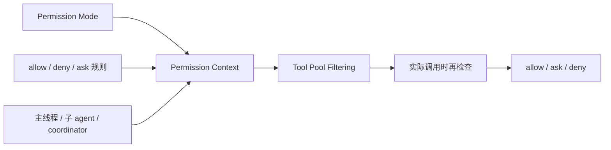

# Permission / Safety Boundaries

## 为什么这一章很重要

很多人一开始做 agent，最先想到的是：

- 我要让它更强
- 我要让它能读文件、改代码、跑命令
- 我要让它尽量自动化

这个方向没错，但如果只想着“更强”，很快就会踩到一个大坑：

**agent 一旦能真的做事，它也就真的可能做错事。**

所以成熟 agent 产品真正追求的不是：

- 让它无所不能

而是：

- 让它在边界内可靠做事

这就是 `permission` 和 `safety boundaries` 的价值。

## 一句话先抓住

- `permission` 决定 agent 哪些动作可以直接做，哪些必须被拦住
- `safety boundary` 决定 agent 的能力边界和风险边界画在哪里

## 先看关系图

这张图最重要的点是：

**模型可以想到一个动作，但真正能不能落地，要经过权限边界。**

## Claude Code 里权限是怎么落在系统里的

这张图想表达的是：

- Claude Code 不是只在“点工具调用那一下”才检查权限
- 它会先影响你能看到哪些工具
- 再影响你真正调用时是否放行

也就是说，权限不是一个按钮，而是一层持续生效的系统约束。

## 1. Permission 到底是什么

在 agent 系统里，permission 不是单纯的“有没有权限”。

更准确地说，它至少包括三类判断：

- 这个动作能不能直接做
- 这个动作能不能在当前模式下做
- 这个动作能不能由当前角色来做

所以 permission 不只是安全功能，它本质上也是：

- 能力配置
- 风险控制
- 角色约束

## 2. 为什么 prompt 里的“不要这样做”不够

很多初学者第一反应是：

- 那我就在 prompt 里写“不要执行危险命令”

这当然有帮助，但不够。

因为 prompt 是软约束，权限是硬约束。

更直接地说：

- prompt 只能告诉模型“最好别这样”
- permission 才能真正阻止“你现在不能这样”

所以成熟系统一定不会只靠 prompt 讲道理，而是会在工具层和运行层真正拦截。

## 3. Permission 和 Tool 是什么关系

这两个是绑得很紧的。

因为权限最终控制的不是“模型脑子里能想什么”，而是：

- 它能调用哪些工具
- 在什么条件下调用
- 谁可以调用

所以从工程上看：

- tool 是能力接口
- permission 是能力边界

一个成熟 agent 系统，几乎一定是在 tool 层做权限控制，而不是只在 prompt 层说“请自觉”。

## 4. Permission 和 Runtime 是什么关系

Permission 本质上属于 runtime 的职责。

因为它不是模型自己能决定的，而是系统决定的：

- 当前是什么模式
- 当前允许哪些工具
- 当前 deny/allow/ask 规则是什么
- 当前角色是不是主线程、子 agent、coordinator

也就是说：

- 模型提出动作意图
- runtime 决定这个意图能不能穿过边界落地

## 5. 为什么这件事在 Claude Code 里尤其重要

Claude Code 是终端 agent，不是普通聊天机器人。

它接近的是真实执行环境：

- 文件系统
- shell
- git 仓库
- 网络
- 多 agent

这意味着它不是“答错了就算了”，而是可能真的：

- 改错文件
- 跑错命令
- 让子 agent 递归失控
- 把高风险动作自动化

所以 Claude Code 一定要认真回答这些问题：

- 哪些工具主线程能用
- 哪些工具异步 agent 能用
- coordinator 到底能干什么
- 哪些规则只是提醒，哪些必须硬拦

这就是它比很多 demo agent 成熟的地方。

## 6. 在当前 claude-code-haha 里，Claude Code 大概是怎么做的

如果先不盯着具体文件，我建议你先抓 Claude Code 在权限这件事上的 4 个实现思路：

### 思路 1：权限不是一个开关，而是一套模式系统

Claude Code 里不是只有“允许 / 不允许”。

它有明显的 mode 概念，比如：

- 默认模式
- plan mode
- accept edits
- bypass permissions
- don't ask
- auto mode

这说明它把权限看成“运行模式”的一部分，而不是一个零散布尔值。

### 思路 2：权限规则会进入运行时上下文

Claude Code 不是把规则写死在某个地方就完了。

它会把：

- allow 规则
- deny 规则
- ask 规则

汇进一个 permission context。

这个 context 会继续影响：

- tool pool 过滤
- 实际调用时的决策
- 用户是否会看到确认请求

### 思路 3：高风险模式不是完全放飞，也要防止“自动化过头”

这是 Claude Code 很值得学的地方。

它不是只有“更严格”一种安全思路，也在认真处理：

- 自动模式下哪些规则会太危险
- Bash / PowerShell 哪些模式可能放开成任意代码执行
- 子 agent 自动放行为什么危险

所以你会看到它专门去检查：

- 危险 Bash 规则
- 危险 PowerShell 规则
- 危险 Agent delegation 规则

这比“让用户自己小心点”高一个层次。

### 思路 4：不同角色拿到的工具集合本来就不一样

Claude Code 不是让所有 agent 共享同一个工具包。

它会区分：

- 主线程
- async agent
- in-process teammate
- coordinator

不同角色能用的工具是裁过的。

这其实也是权限设计的一部分。

真正成熟的权限系统，不只是“调用时拦截”，而是“在能力池阶段就限制角色能力”。

## 7. 你在源码里先看哪几个点

如果你想把这一章和当前仓库连起来，建议先看这几个文件：

- [PermissionMode.ts](../../src/utils/permissions/PermissionMode.ts)
  先看 Claude Code 到底有哪些 permission mode
- [permissionSetup.ts](../../src/utils/permissions/permissionSetup.ts)
  这里最适合理解权限模式、危险规则检查、auto mode 相关策略
- [permissions.ts](../../src/utils/permissions/permissions.ts)
  这里能看到 allow / deny / ask 规则是怎么匹配和解释的
- [tools.ts](../../src/tools.ts)
  这里能看到 permission context 怎么先过滤 tool pool
- [constants/tools.ts](../../src/constants/tools.ts)
  这里能看到不同 agent / coordinator 的工具边界

阅读时建议带着这几个问题：

- 它是先裁能力池，还是等调用时才拦
- 它有哪些 permission mode
- 危险动作是怎么被识别的
- 为什么子 agent 的工具集合会被单独限制

## 8. 这一章最值得记住的结论

你可以先记住这 5 句话：

- permission 决定动作能不能真正落地
- prompt 是软约束，permission 是硬约束
- Claude Code 的权限系统是模式化的，不是零散补丁
- 工具边界本身就是权限边界
- 多 agent 场景下，权限设计会比单 agent 更重要

## 9. 一个帮助记忆的比喻

你可以把它记成：

- model = 脑子
- tool = 手脚和工具箱
- permission = 门禁、刹车和保险丝

脑子可以想到很多动作，  
但门禁、刹车和保险丝决定你到底能不能真的做出去。
