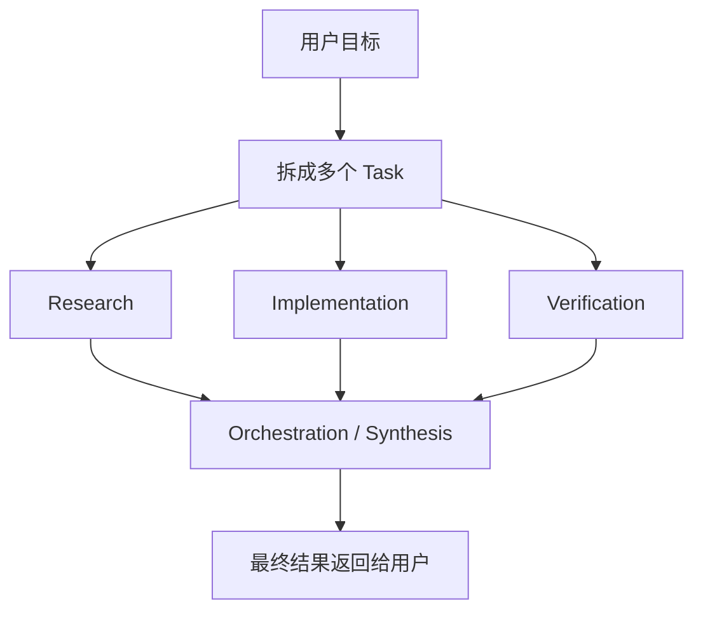
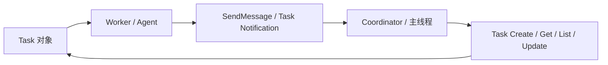

# Task / Workflow / Orchestration

## 为什么这一章很重要

很多人第一次接触 agent，会默认把它想成：

- 一个模型
- 一次推理
- 一次工具调用

这在简单场景里还说得过去，但一旦任务稍微复杂，就不够了。

比如：

- 先研究代码，再修改，再验证
- 多个子 agent 并行探索不同方向
- 一个 agent 做研究，另一个 agent 做实现
- 中间结果需要汇总，而不是各自散着

这时候你就会遇到三个词：

- `task`
- `workflow`
- `orchestration`

它们不是花哨名词，而是 agent 从“会调用工具”变成“能组织工作”的关键。

## 一句话先抓住

- `task` 是系统里被创建、跟踪、更新的工作单元
- `workflow` 是一类任务通常怎么推进的步骤模式
- `orchestration` 是对多个 task、多个 worker、多个阶段的协调与调度

## 先看关系图

这张图最重要的点是：

**复杂 agent 不是一口气做完，而是把目标拆成多个可跟踪的工作单元，再组织这些单元。**

## Claude Code 里这件事为什么会变复杂

这张图想表达的是：

- Claude Code 的多 agent 不是“多开几个模型窗口”
- 它需要 task、消息、更新、回收结果这些基础设施

这也是为什么你会在源码里看到 task 工具、send message、coordinator mode 这些模块。

## 1. Task 到底是什么

Task 可以理解成：

- 一个被系统正式承认、可以跟踪状态的工作单元

它和“模型脑子里想做的一步”不完全一样。

因为一旦一个工作要被多个阶段、多个 agent、多个工具共同推进，它就需要：

- 有身份
- 有状态
- 有描述
- 有 owner
- 可以被更新

所以 task 更像：

- 工单
- 待办项
- 可追踪任务对象

而不只是“模型刚想到的下一步动作”。

## 2. Workflow 到底是什么

Workflow 更像：

- 一类任务通常怎么推进的模式

比如做代码修复，常见 workflow 可能是：

1. 先研究问题
2. 再改代码
3. 再验证
4. 再汇总结果

它不是单一 task，也不是单一工具调用。

它更像：

- 一个任务推进模板

## 3. Orchestration 到底是什么

Orchestration 可以理解成：

- 对多个阶段、多个任务、多个 agent 的协调和调度

如果说 workflow 是“这类事通常怎么做”，  
那 orchestration 更像：

- 这一次具体怎么安排谁做什么、什么时候做、结果怎么汇总

所以 orchestration 更偏运行时组织。

## 4. 为什么这三个词在 agent 里这么重要

因为复杂任务并不是靠“一次更聪明的推理”解决的。

真正让 agent 从 demo 走向产品的，是它能不能：

- 拆任务
- 跟踪任务
- 协调多个执行者
- 汇总阶段性结果
- 在失败后继续推进

换句话说：

**agent 的复杂度，很多时候不是推理复杂度，而是组织复杂度。**

## 5. 这和 Todo / Memory / 一般工具调用有什么区别

这几个东西很容易混。

### Task 和 Todo 的区别

Todo 更像轻量待办。  
Task 更像系统化的工作对象。

### Task 和 Memory 的区别

Memory 是为了未来复用信息。  
Task 是为了当前把工作推进完。

### Task 和 Tool Call 的区别

Tool call 是一次动作。  
Task 是一个可能包含很多动作的工作单元。

## 6. 在 Claude Code 里为什么必须学这个

Claude Code 的价值不只是“工具多”，还在于它已经开始认真解决这些问题：

- 任务如何作为对象存在
- 多 agent 如何协作
- worker 怎么把结果发回主线程
- coordinator 怎么继续派发下一步
- 哪些工具主线程能用，哪些 worker 才能用

如果你不理解 task / workflow / orchestration，后面看到：

- `tasks.ts`
- `SendMessageTool`
- `TaskCreateTool`
- `TaskUpdateTool`
- `coordinatorMode`

就会觉得它们像一堆杂碎功能。

但其实这些东西都在共同解决：

- agent 如何组织复杂工作

## 7. 在当前 claude-code-haha 里，Claude Code 大概是怎么做的

如果先不盯着具体文件，我建议你先抓 Claude Code 在这件事上的 4 个实现思路：

### 思路 1：Task 是一等对象，不只是脑内步骤

Claude Code 里有专门的 task 定义、task 工具、task list、task owner、task status。

这说明它不是把任务管理留给模型自己“记着”，而是把任务外化成系统对象。

### 思路 2：多 agent 协作靠的是基础设施，不是魔法

Claude Code 不是让子 agent 自己随便发挥。

它通过：

- `AgentTool`
- `SendMessageTool`
- `TaskCreate / Get / List / Update`
- task notification

让 worker 和 coordinator 之间能真正形成一个闭环。

### 思路 3：Coordinator 不是普通 prompt，而是一种特殊运行模式

Claude Code 里 coordinator mode 不是“换一段 prompt 就完了”。

它还会连带改变：

- worker 可见工具
- coordinator 自己的工具集合
- 系统提示内容
- 结果汇总方式

这说明 orchestration 在 Claude Code 里是 runtime 级设计，不只是文案层设计。

### 思路 4：不同阶段应该由不同角色承担

Claude Code 的一些文案和模式都明显在强调：

- research 可以并行
- implementation 要注意写冲突
- verification 不能只是走形式
- synthesis 应该由 coordinator 来做

这说明它不是“多开几个 agent 就好了”，而是认真在做角色分工。

## 8. 你在源码里先看哪几个点

如果你想把这一章和当前仓库连起来，建议先看这几个文件：

- [tasks.ts](../../src/tasks.ts)
  先看 Claude Code 里有哪些 task 类型
- [tools.ts](../../src/tools.ts)
  这里能看到 task 相关工具是怎么进入工具池的
- [coordinatorMode.ts](../../src/coordinator/coordinatorMode.ts)
  这里最适合理解 coordinator 这个角色到底被定义成什么
- [TaskCreateTool.ts](../../src/tools/TaskCreateTool/TaskCreateTool.ts)
  看 task 是怎么被创建的
- [TaskListTool.ts](../../src/tools/TaskListTool/TaskListTool.ts)
  看系统怎么枚举和暴露任务
- [SendMessageTool.ts](../../src/tools/SendMessageTool/SendMessageTool.ts)
  看 worker 和 coordinator 是怎么继续交互的
- [constants/tools.ts](../../src/constants/tools.ts)
  看不同角色的工具权限是怎么裁的

阅读时建议带着这几个问题：

- task 在系统里是不是一等对象
- worker 结果是怎么被发回主线程的
- coordinator 为什么不是普通 agent
- 为什么 task、message、tool permission 会一起出现

## 9. 这一章最值得记住的结论

你可以先记住这 5 句话：

- task 是可跟踪的工作对象，不只是脑内步骤
- workflow 是任务推进模板
- orchestration 是运行时调度和协调
- 多 agent 的难点不是“多”，而是“协作”
- Claude Code 的 task / coordinator 体系，本质上是在解决复杂任务组织问题

## 10. 一个帮助记忆的比喻

你可以把它记成：

- task = 工单
- workflow = 标准作业流程
- orchestration = 项目经理在排班、派工、收结果

模型再聪明，也不能替代一个团队的组织方式。  
Claude Code 值得学的地方，就在于它开始认真处理这层“组织问题”。
