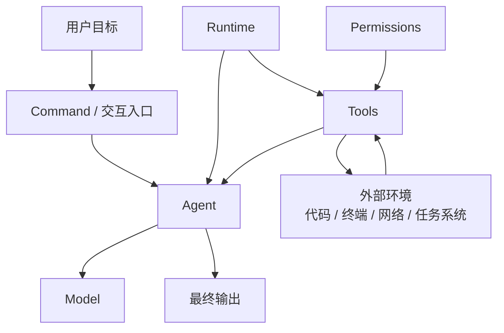

# Claude Code 为什么好用

## 大家真正想知道的问题

很多人并不是真的想问：

- Claude Code 用的是什么模型

大家真正想知道的往往是：

- 为什么同样是强模型，Claude Code 明显更像一个成熟 agent 产品？
- 它到底牛在哪里？
- 到底是哪些设计让它比普通 agent 更稳、更强、更像“能干活的系统”？

这一章就是专门回答这个问题。

## 先说结论

Claude Code 好用，不只是因为 Claude 模型强。

更重要的是，它把下面这些东西做成了一个比较成熟的整体：

- model
- runtime
- tools
- permissions
- task flow
- multi-agent coordination
- harness engineering

换句话说，Claude Code 的好用来自：

**强模型 + 好的运行时 + 好的执行策略 + 好的产品交互**

如果再说得更直接一点：

**Claude Code 牛，不只是因为“脑子好”，而是因为 Anthropic 把“脑子、手脚、规则、上下文、权限和产品体验”整套都做顺了。**

## 先看关系图

这张图想说明的是：

- Claude Code 不是“模型直接对着用户输出”
- 它中间还有 runtime、tools、permissions、task flow 这些关键层

## 先看 Claude Code 为什么会让人觉得“牛”

如果只用最白话的话总结，我觉得 Claude Code 让人觉得强，主要是因为它同时做到了这几件事：

1. 它不是聊天机器人思维，而是任务系统思维
2. 它不是只会调工具，而是会管理工具、权限、状态和节奏
3. 它不是只追求更强，还追求更可控
4. 它不是 demo 级 agent，而是明显带着产品工程思维

也就是说，大家感觉它“牛”，很多时候不是因为某个单点神奇，而是因为：

- 各层都不短板
- 系统整体很完整
- 体验上没有明显塌陷点

## 为什么“模型强”还不够

如果只有强模型，但没有好的 agent 系统设计，会出现很多问题：

- 不知道什么时候该调用工具
- 调了工具也不知道怎么接回下一步
- 权限边界不清楚，容易乱做事
- 任务推进节奏不稳定
- 多 agent 情况下容易混乱

所以：

- 强模型只能决定推理上限
- 真正的产品体验，还取决于整套 agent system 怎么设计

## Claude Code 真正强在哪

下面这几条，我觉得是最值得学的地方。

### 1. command 和 tool 分层清楚

这点非常重要。

- command 面向用户
- tool 面向模型

这会让整个产品既容易用，又不会把底层能力和高层入口混在一起。

它解决的真实痛点是：

- 用户不想直接操作一堆底层能力
- 模型也不该随便乱触发产品级模式

很多简化版 agent 会把这两层混在一起，最后体验会很乱。

### 2. tool system 很完整

Claude Code 不是只能聊天，它可以真正作用于外部环境，例如：

- 读文件
- 搜代码
- 改文件
- 跑终端命令
- 管理任务

这让它从“回答系统”变成了“任务系统”。

它解决的真实痛点是：

- 只靠语言模型无法真正接触环境
- 没有完整工具系统，agent 只能停留在“会说”

Claude Code 的工具不是演示性质的几个 function，而是一整套真正可工作的能力池。

### 3. permission system 很关键

好用不只是“能做很多事”，还包括“不会乱做事”。

Claude Code 比较值得学的一点就是：

- 它不是无条件把所有能力都开放给每个 agent
- 它会按模式、角色、场景做限制

这会显著提升：

- 可控性
- 可预测性
- 长期使用时的信任感

它解决的真实痛点是：

- agent 一强起来就容易乱动环境
- 多 agent 一上来就可能失控

所以 Claude Code 值得学的一点不是“能力多”，而是：

- 它在认真设计哪些能力该给、哪些不该给

### 4. task flow 更像真正的工作流

Claude Code 的运行方式不是“只回答一句话”，而是：

- 读上下文
- 推理
- 调工具
- 看反馈
- 再推理
- 再推进任务

这也是它更像 agent，而不是普通聊天机器人的原因。

它解决的真实痛点是：

- 很多 agent 只能一轮轮答题，不能稳定推进长任务
- 工具结果和后续动作接不起来

Claude Code 在这块明显是按“完整闭环”在设计，而不是按“单次输出”在设计。

### 5. 多 agent 不是噱头，而是有基础设施支撑

如果只是同时开几个模型窗口，那不叫成熟 multi-agent。

Claude Code 更有价值的地方是，它已经有了这种方向的基础设施：

- task
- coordinator
- messaging
- agent tool restrictions

这说明它考虑的是：

- 怎么分工
- 怎么通信
- 怎么限制权限
- 怎么收敛结果

它解决的真实痛点是：

- 多 agent 不是多开几个模型窗口就行
- 不做调度、通信和约束，只会更乱

所以 Claude Code 的 multi-agent 价值，不在“支持多个 agent”这句话本身，而在：

- 它知道多 agent 真正难在哪

### 6. context 和 prompt 都不是“随便拼一下”

Claude Code 很值得学的一点，是它明显把：

- context
- prompt

都当成工程对象在做，而不是临时拼文本。

这会体现在：

- system/user context 拆层
- prompt 分层装配
- memory / tool result 回流
- compact / context 膨胀治理

它解决的真实痛点是：

- 模型不是知道“系统里有什么”，而是只知道“当前上下文里有什么”
- prompt 和 context 一乱，后面的工具和模型都会跟着乱

### 7. 它明显在做“产品工程”，不是只做“agent 实验”

Claude Code 的强，还有一个很现实的来源：

- 它不是只关心模型输出质量
- 它也关心启动速度、session、resume、trust、terminal UX、可恢复性

这点特别重要。

因为真正长期可用的 agent，不是“偶尔很聪明”，而是：

- 大部分时候都稳定
- 出问题时也不至于全崩
- 用户敢持续交给它做事

这背后全是工程设计。

## 为什么同样的模型和 tools，不同 agent 也会差很多

因为产品体验并不只由模型和 tools 决定，还取决于：

- tool description 怎么写
- 调用顺序怎么组织
- 上下文怎么打包
- 什么时候问用户确认
- 什么时候停止
- 出错怎么恢复

这些部分，很多都属于 harness engineering。

所以真正更准确的说法是：

**Claude Code 的价值，不只是 Claude 模型强，而是 Anthropic 把这套 agent 系统做得比较成熟。**

## 在当前 claude-code-haha 里，Claude Code 的“牛逼设计”大概落在哪

如果你想把上面这些话落回源码，我建议先从下面这些点去理解，不要一上来陷进细节。

### 1. 分层能力设计

先看：

- [src/commands.ts](../../src/commands.ts)
- [src/tools.ts](../../src/tools.ts)

这两个文件很适合回答：

- 为什么 command 和 tool 是两层
- Claude Code 为什么不像一个“工具堆”，而像一个产品

### 2. 权限和角色裁剪

先看：

- [src/constants/tools.ts](../../src/constants/tools.ts)

这个文件很适合回答：

- 为什么不同 agent 拿到的工具不一样
- 为什么 Claude Code 在多 agent 上相对更稳

### 3. prompt / context / query 真正汇合的地方

先看：

- [src/utils/systemPrompt.ts](../../src/utils/systemPrompt.ts)
- [src/context.ts](../../src/context.ts)
- [src/QueryEngine.ts](../../src/QueryEngine.ts)

这几个文件很适合回答：

- 为什么 Claude Code 的行为不是靠一段 prompt 决定的
- 为什么 context、prompt、permissions、tool use 是一起工作的

### 4. 整个 runtime 怎么装起来

先看：

- [src/main.tsx](../../src/main.tsx)
- [src/entrypoints/cli.tsx](../../src/entrypoints/cli.tsx)

这两个文件很适合回答：

- Claude Code 为什么更像一个 runtime，而不是一个 prompt demo
- 它为什么在产品感上明显强一截

## 你读这一章时最值得带走的判断标准

以后你再看任何 agent 产品，不要只问：

- 它用的是什么模型

你更应该问：

- 它怎么做 command / tool 分层？
- 它怎么组织 context 和 prompt？
- 它怎么做权限边界？
- 它怎么推进 task flow？
- 它怎么处理多 agent？
- 它有没有产品级运行时设计？

能回答这些，才是真正在看“为什么它好用”。

## 一个帮助记忆的比喻

你可以先这样记：

- model = 发动机
- agent = 变速箱 / 传动系统
- runtime = 整车控制系统
- tool = 方向盘 / 油门 / 刹车 / 工具箱
- permissions = 限速器 / 安全保护
- harness = 驾驶控制策略

这个比喻不是逐项精确映射，而是帮助你理解：

- 不是有发动机就等于车好开
- 也不是有工具就等于 agent 好用
- 真正决定体验的是整套系统怎么配合

## 这一章最重要的收获

如果你只带走一句话，我希望是这句：

**Claude Code 让人觉得“牛”，不是因为它只有一个强模型，而是因为 Anthropic 把分层、工具、权限、上下文、闭环和产品工程一起做成熟了。**
