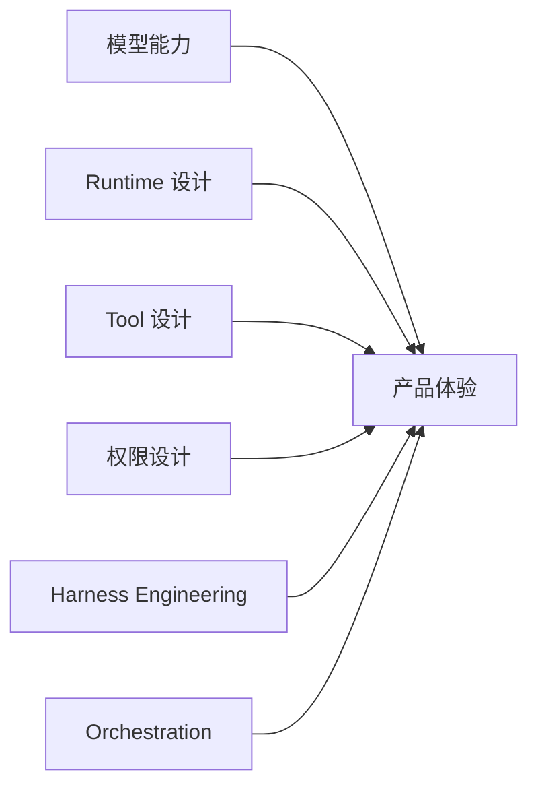

# 八条工程经验

## 为什么这一章重要

如果你只是看 Claude Code 源码，很容易变成“看了很多文件，但不知道该学什么”。

这一章的目标就是把值得迁移到自己项目里的经验提炼出来。

也就是说，这一章不是讲“Claude Code 做了什么”，而是讲：

**我们到底应该从它身上抄走什么工程方法。**

## 先看关系图

这张图要表达的核心是：

- 产品体验不是单一因素决定的
- 模型只是其中一部分
- runtime、tool、permission、harness、orchestration 同样重要

## 1. 不要把模型当产品

很多人做 agent 的第一反应是：

- 换更强的模型
- 调 prompt
- 再多加几个 tool

但 Claude Code 提醒我们的第一件事是：

**模型不是产品，模型只是产品里的推理引擎。**

真正的产品还要解决：

- 用户入口
- 状态管理
- 工具接入
- 权限边界
- 任务推进
- 多 agent 协调

可迁移原则：

- 做 agent 时先想系统，不要只想模型

## 2. Prompt 很重要，但 tool 更决定落地能力

没有 tool，模型再聪明也只能生成文字。

有了 tool，agent 才能真正去：

- 读文件
- 改代码
- 跑命令
- 接触外部环境

可迁移原则：

- prompt 决定怎么想
- tool 决定能做什么

## 3. command 和 tool 一定要分层

用户入口和模型动作接口不能混在一起。

更清楚的分工是：

- command 面向用户
- tool 面向模型

可迁移原则：

- 高层产品入口和底层动作能力要分开设计

## 4. 权限系统不是附属品，而是主体设计的一部分

普通问答产品答错了，主要是认知错误。

agent 产品一旦接入工具，错的可能不只是答案，而是动作：

- 改错文件
- 跑错命令
- 权限越界

可迁移原则：

- 高风险能力要用硬约束限制
- 不要只靠 prompt 说“请不要这样做”

## 5. 同样的模型和工具，不同 harness 结果会差很多

为什么两个 agent：

- 用的是同一模型
- 暴露的是同一套工具

最后表现还是可能差非常多？

因为中间还有一层关键东西：

- harness engineering

它决定：

- 调用顺序
- 上下文组织
- 错误恢复
- 停止条件
- 确认策略

可迁移原则：

- 不要把 agent 调优理解成“多改几句 prompt”

## 6. 启动链路和初始化流程要认真设计

成熟 agent 产品不会每次启动都把所有模块全量加载。

Claude Code 值得学的一点是：

- fast path
- 动态加载
- 并行初始化

这些会直接影响：

- 启动速度
- 交互体验
- 资源使用

可迁移原则：

- 启动链路本身就是产品体验的一部分

## 7. 多 agent 的难点是组织，不是并行

很多人对 multi-agent 的第一反应是：

- 多开几个模型就行

但真正难的是：

- 任务怎么拆
- agent 怎么通信
- 权限怎么隔离
- 结果怎么汇总

可迁移原则：

- 先设计 task、message、coordinator，再谈并行收益

## 8. 好的 agent 要让用户敢用，而不只是看起来很强

长期可用的 agent 产品，最重要的不是“偶尔惊艳”，而是：

- 稳
- 可控
- 可预测
- 有边界感

可迁移原则：

- 设计确认机制
- 设计停止条件
- 设计保守默认值
- 设计可见的进度反馈

## 这一章最重要的收获

如果你只带走一句话，我希望是这句：

**Claude Code 最值得学的，不只是某段代码，而是它背后的 agent engineering 方法论。**
